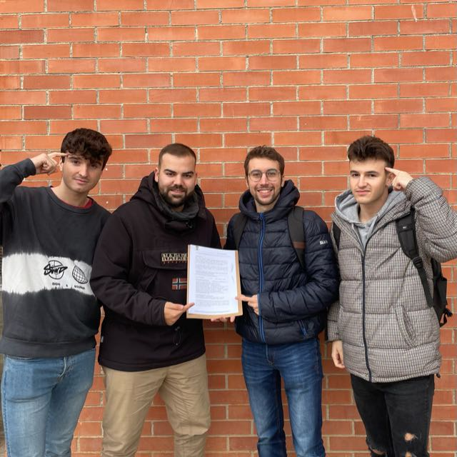

# Projecte PAE
Implementació i apropament de la tecnología blockchain per a la resolució
de conflictes entre una comunitat. Consulteu el contracte estàndard 'community.sol'.

La api(backend) ja està online a https://smart-president.herokuapp.com


### Run the backend in Terminal
```
cd backend
npm install
npm start
```

### Run the frontend in Terminal
```
cd frontend
npm install
npm start
```

# Contriutors
- Julen Galera Vitoria
- Álvaro Borao Fortún
- Antoni Bergas Galmés 
- Alfons Caparrós Bazo




